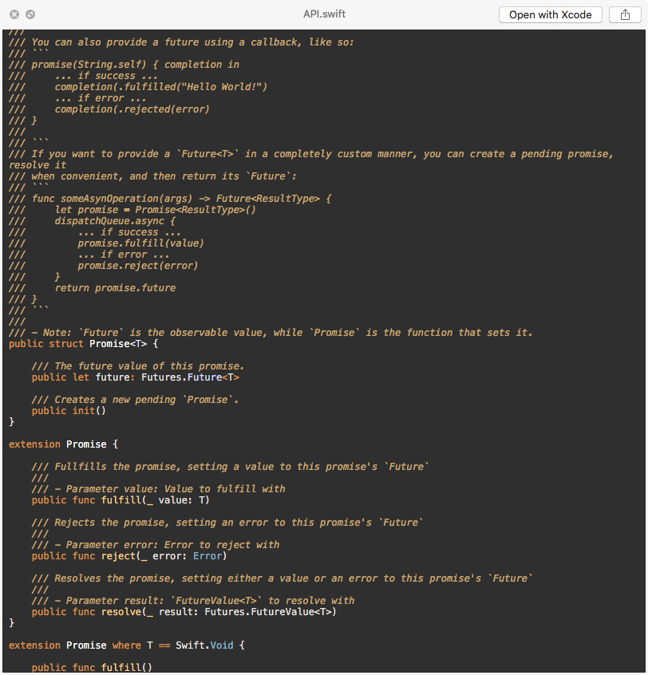
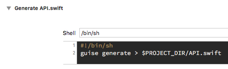

# Generate Public API

This command line tool will generate the public interface for a swift module using [sourcekitten](https://github.com/jpsim/SourceKitten). The tool will infer the environment variables set by xcode build and write it's contents to a file `API.swift` located in the modules project directory so that you are able to review the differences during code review.



## Usage

This command line tool is meant to be used in an `Xcode` `Run Script Phase`.



### Download a pre-built release

1. Head over to [Releases](https://github.com/ollieatkinson/swift-public-api-generator/releases)
2. Download `public-api-generator` from one of the versions

### Install from source

```bash
make release
```

The binary will be output at the top level of the directory.

### Development

```bash
make project
open public-api-generator.xcodeproj
```

## Motivation & Discovery

I was at a stage where me and my team were creating modules for an iOS app, this helped us seperate concerns - but we rarely did an API review of those modules because it wasn't easy. And being able to review the API is something we deemed quite important as a team moving forward. By reviewing the API we can question the interface and care less about what's behind it, because that can be refactored at a later date.

One of the team members noticed if you `⌘ + Click` on the module name (`import FeatureA`), you see a generated interface! Bingo! This looked like the information what we needed to get. 

I knew a tool called [sourcekitten](https://github.com/jpsim/SourceKitten) existed, which allows you to interact with SourceKit, and specifically remember reading how to log exactly what it's doing using a little trick [shown here](https://www.jpsim.com/uncovering-sourcekit/).

```bash
export SOURCEKIT_LOGGING=3 && /Applications/Xcode.app/Contents/MacOS/Xcode
```

Using this we were able to track down that when you open the interface, it makes the following request: `source.request.editor.open.interface`

```yaml
{
  key.request: source.request.editor.open.interface,
  key.name: "9662B804-A91C-4AB4-ACEF-ABF02A9D0192",
  key.compilerargs: [
    "-target",
    "arm64-apple-ios11.3",
    "-module-name",
    "FuturesTests",
    "-sdk",
    "/Applications/Xcode.app/Contents/Developer/Platforms/iPhoneOS.platform/Developer/SDKs/iPhoneOS11.4.sdk",
    "-I",
    "-Xcc",
    "-I",
    "/Users/oliveratkinson/Library/Developer/Xcode/DerivedData/Futures-gieuezrbbfehmphisgvebirbwkml/Build/Products/Debug-iphoneos",
    "-I",
    "/Users/oliveratkinson/Library/Developer/Xcode/DerivedData/Futures-gieuezrbbfehmphisgvebirbwkml/Build/Intermediates.noindex/Futures.build/Debug-iphoneos/FuturesTests.build/swift-overrides.hmap",
    "-I",
    "/Users/oliveratkinson/Library/Developer/Xcode/DerivedData/Futures-gieuezrbbfehmphisgvebirbwkml/Build/Intermediates.noindex/Futures.build/Debug-iphoneos/FuturesTests.build/FuturesTests-own-target-headers.hmap",
    "-I",
    "/Users/oliveratkinson/Library/Developer/Xcode/DerivedData/Futures-gieuezrbbfehmphisgvebirbwkml/Build/Intermediates.noindex/Futures.build/Debug-iphoneos/FuturesTests.build/FuturesTests-all-target-headers.hmap",
    "-I",
    "/Users/oliveratkinson/Library/Developer/Xcode/DerivedData/Futures-gieuezrbbfehmphisgvebirbwkml/Build/Products/Debug-iphoneos/include",
    "-I",
    "/Users/oliveratkinson/Library/Developer/Xcode/DerivedData/Futures-gieuezrbbfehmphisgvebirbwkml/Build/Intermediates.noindex/Futures.build/Debug-iphoneos/FuturesTests.build/DerivedSources/arm64",
    "-I",
    "/Users/oliveratkinson/Library/Developer/Xcode/DerivedData/Futures-gieuezrbbfehmphisgvebirbwkml/Build/Intermediates.noindex/Futures.build/Debug-iphoneos/FuturesTests.build/DerivedSources",
    "-I",
    "/Applications/Xcode.app/Contents/Developer/Platforms/iPhoneOS.platform/Developer/SDKs/iPhoneOS11.4.sdk/usr/local/include",
    "-F",
    "-Xcc",
    "-F",
    "/Users/oliveratkinson/Library/Developer/Xcode/DerivedData/Futures-gieuezrbbfehmphisgvebirbwkml/Build/Products/Debug-iphoneos",
    "-F",
    "/Applications/Xcode.app/Contents/Developer/Platforms/iPhoneOS.platform/Developer/Library/Frameworks",
    "-F",
    "/Applications/Xcode.app/Contents/Developer/Platforms/iPhoneOS.platform/Developer/SDKs/iPhoneOS11.4.sdk/System/Library/PrivateFrameworks",
    "-D",
    "DEBUG",
    "-D",
    "DEBUG=1",
    "-Xcc",
    "-iquote",
    "-Xcc",
    "/Users/oliveratkinson/Library/Developer/Xcode/DerivedData/Futures-gieuezrbbfehmphisgvebirbwkml/Build/Intermediates.noindex/Futures.build/Debug-iphoneos/FuturesTests.build/FuturesTests-generated-files.hmap /Users/oliveratkinson/Library/Developer/Xcode/DerivedData/Futures-gieuezrbbfehmphisgvebirbwkml/Build/Intermediates.noindex/Futures.build/Debug-iphoneos/FuturesTests.build/FuturesTests-project-headers.hmap",
    "-Xcc",
    "-I",
    "-Xcc",
    "/Users/oliveratkinson/Library/Developer/Xcode/DerivedData/Futures-gieuezrbbfehmphisgvebirbwkml/Build/Products/Debug-iphoneos",
    "-Xcc",
    "-I",
    "-Xcc",
    "/Users/oliveratkinson/Library/Developer/Xcode/DerivedData/Futures-gieuezrbbfehmphisgvebirbwkml/Build/Intermediates.noindex/Futures.build/Debug-iphoneos/FuturesTests.build/swift-overrides.hmap",
    "-Xcc",
    "-I",
    "-Xcc",
    "/Users/oliveratkinson/Library/Developer/Xcode/DerivedData/Futures-gieuezrbbfehmphisgvebirbwkml/Build/Intermediates.noindex/Futures.build/Debug-iphoneos/FuturesTests.build/FuturesTests-own-target-headers.hmap",
    "-Xcc",
    "-I",
    "-Xcc",
    "/Users/oliveratkinson/Library/Developer/Xcode/DerivedData/Futures-gieuezrbbfehmphisgvebirbwkml/Build/Intermediates.noindex/Futures.build/Debug-iphoneos/FuturesTests.build/FuturesTests-all-target-headers.hmap",
    "-Xcc",
    "-I",
    "-Xcc",
    "/Users/oliveratkinson/Library/Developer/Xcode/DerivedData/Futures-gieuezrbbfehmphisgvebirbwkml/Build/Products/Debug-iphoneos/include",
    "-Xcc",
    "-I",
    "-Xcc",
    "/Users/oliveratkinson/Library/Developer/Xcode/DerivedData/Futures-gieuezrbbfehmphisgvebirbwkml/Build/Intermediates.noindex/Futures.build/Debug-iphoneos/FuturesTests.build/DerivedSources/arm64",
    "-Xcc",
    "-I",
    "-Xcc",
    "/Users/oliveratkinson/Library/Developer/Xcode/DerivedData/Futures-gieuezrbbfehmphisgvebirbwkml/Build/Intermediates.noindex/Futures.build/Debug-iphoneos/FuturesTests.build/DerivedSources",
    "-Xcc",
    "-F",
    "-Xcc",
    "/Users/oliveratkinson/Library/Developer/Xcode/DerivedData/Futures-gieuezrbbfehmphisgvebirbwkml/Build/Products/Debug-iphoneos",
    "-Xcc",
    "-D",
    "-Xcc",
    "DEBUG=1",
    "-Xcc",
    "-working-directory",
    "-Xcc",
    "/Users/oliveratkinson/Programming/iOS/Futures",
    ""
  ],
  key.modulename: "Futures",
  key.toolchains: [
    "com.apple.dt.toolchain.XcodeDefault"
  ],
  key.synthesizedextensions: 1
}
```

We noticed a lot of the arguments above were not actually required to get the information we needed, so we deleted the excess ones and ended up with a much smaller snippet:

```yaml
key.request: source.request.editor.open.interface
key.name: "9662B804-A91C-4AB4-ACEF-ABF02A9D0192"
key.compilerargs:
    - "-target"
    - "arm64-apple-ios11.3"
    - "-sdk"
    - "/Applications/Xcode.app/Contents/Developer/Platforms/iPhoneOS.platform/Developer/SDKs/iPhoneOS11.4.sdk"
    - "-I"
    - "/Users/oliveratkinson/Library/Developer/Xcode/DerivedData/Futures-gieuezrbbfehmphisgvebirbwkml/Build/Products/Debug-iphoneos"
    - "-F"
    - "/Users/oliveratkinson/Library/Developer/Xcode/DerivedData/Futures-gieuezrbbfehmphisgvebirbwkml/Build/Products/Debug-iphoneos"
    - "-I"
    - "/Users/oliveratkinson/Library/Developer/Xcode/DerivedData/Futures-gieuezrbbfehmphisgvebirbwkml/Build/Products/Debug-iphoneos/include"
key.modulename: "Futures"
key.toolchains: [ "com.apple.dt.toolchain.XcodeDefault" ]
key.synthesizedextensions: 1
```

Then by inspecting the values inside and the values passed using the environment variables in xcodebuild I was able to build a template:

```yaml
key.request: source.request.editor.open.interface
key.name: "9662B804-A91C-4AB4-ACEF-ABF02A9D0192"
key.compilerargs:
    - "-target"
    - "{{CURRENT_ARCH}}-apple-{{SWIFT_PLATFORM_TARGET_PREFIX}}{{IPHONEOS_DEPLOYMENT_TARGET or MACOSX_DEPLOYMENT_TARGET}}"
    - "-sdk"
    - "{{SDK_DIR}}"
    - "-I"
    - "{{CONFIGURATION_BUILD_DIR}}"
    - "-F"
    - "{{CONFIGURATION_BUILD_DIR}}"
    - "-I"
    - "{{CONFIGURATION_BUILD_DIR}}/include"
key.modulename: "{{PRODUCT_MODULE_NAME}}"
key.toolchains:
    - "{{TOOLCHAIN_IDENTIFIER}}"
key.synthesizedextensions: 1
```

I initially created a bash script for this https://gist.github.com/ollieatkinson/b8b84a1de3e06946abb76eeeada73574, which worked fine but I wanted to play around with a swift command line tool.

So... after all of that, we can now use the tool `public-api-generator` to generate `API.swift` and track the changes to a public interface of a module during code review.

Cheers 🍻
